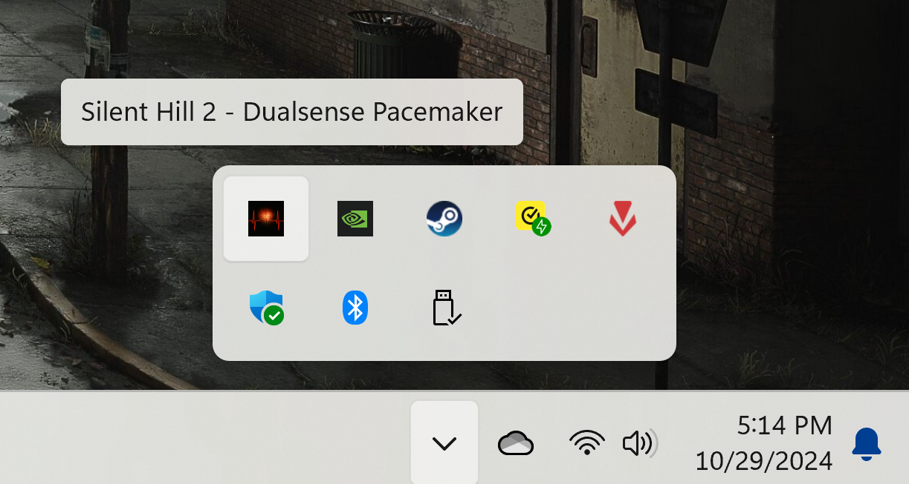
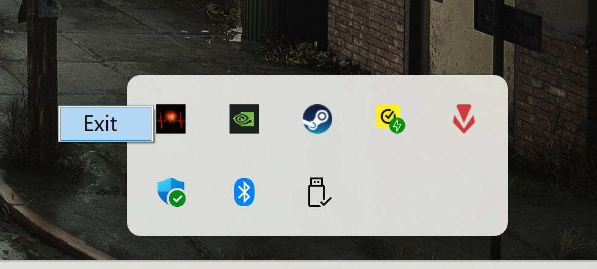

# Silent Hill 2 Dualsense Pacemaker

**Tired of your Dualsense magic vanishing into the Otherworld every few minutes?** You're not alone. This might be the dorkiest little app ever, but it'll keep your Dualsense sorcery flowing smoothly in Silent Hill 2.

**Silent Hill 2 Dualsense Pacemaker** is a tiny Windows app that quietly pulses a keystroke every 15 seconds, keeping your Dualsense features (i.e., adaptive triggers and haptic feedback) front and center. Until the devs work their magic, this is the next best thing. I've been using it nonstop, and I've almost forgotten about this Dualsense features issue.

**No more fumbling with keys or losing immersion.** Just let the Pacemaker do its thing while you dive deep into the terrifying world of Silent Hill 2! 🤟

# Download & Run

**Grab Your Pacemaker:**
- **The Sleek One:** [**sh2-pacemaker.exe**](https://github.com/tpetsas/sh2-dualsense-pacemaker/releases/download/1.0.0/sh2-pacemaker.exe) — Lightweight, but needs the .NET 8.0 Runtime. — **Recommended**
- **The Chunky One:** [**sh2-pacemaker-self-contained.exe**](https://github.com/tpetsas/sh2-dualsense-pacemaker/releases/download/1.0.0/sh2-pacemaker-self-contained.exe) — All-in-one package, but a bit of a heavyweight.

**Start Your Heartbeat:**

Double-click your chosen Pacemaker, and it'll settle into your system tray, quietly keeping your DualSense alive:

**Power Down:**

When you're done with Silent Hill 2, right-click the tray icon and bid farewell to the Pacemaker.

---

> **A Note on the Noise:**
> You might see some PC symbols instead of the PS ones pop up occasionally, but don't worry. It's just a little glitch that won't affect your gameplay.

Happy Haunting!
